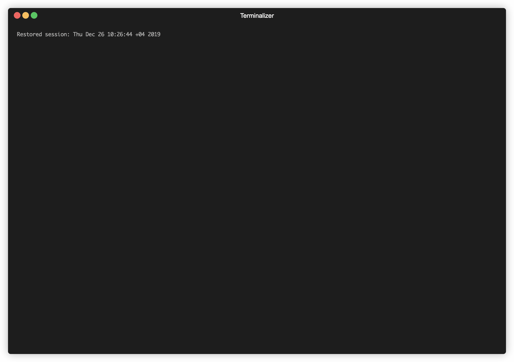

# Multi-Threaded-File-Downloader

A multithreaded CLI tool to download a file from a given URL and transfer downloaded files acrosss devices easily.

#### Features
- [x] Multithreaded to allow concurretly downloading different parts of the file.
- [x] Detects bad network connections and can pauses/resumes download automatically. 
- [x] The downloaded file can be quickly transferred across devices through a local network using a QR code.
- [x] Progress bar to see the status of download.




## Installation

```
git clone https://github.com/Pavitra122/Multi-Threaded-File-Downloader
cd Multi-Threaded-File-Downloader
pip3 install -r requirements.txt
chmod +x downloader.py
```

## Usage

```
./downloader.py <URL> -c nThreads --filename <fileName>

Note: nThreads and fileName are optional arguments
```
Example:
```
./downloader.py "http://commondatastorage.googleapis.com/gtv-videos-bucket/sample/images/BigBuckBunny.jpg"
```

Can be used as 
```
./downloader.py <URL> -c nThreads --filename <fileName>
```
by renaming downloader.py to downloader. Note that this breaks the dependency link to run the unit tests.


## Unit Tests

```
python3 test_downloader.py
```


## Implementation Details

Uses a consumer-producer synchronised queue of tasks across threads. Given a URL, a list of tasks are created each assigned to a certain region of a file.

Each of the threads then load a task from the queue, download a small chunk of the data from the server and store it in the appropriate index in the file and repeat this process until the queue is empty.

Consecutive tasks are assigned to **coallaced** regions of the file. This is done to ensure that, in the case that a download must be stopped, the data downloaded so far is useful.<br/>
<br/>For example:<br/>
Consider there are 3 threads running togeher and each of them is responsible for downloading a chunk of 50 bytes

In the first iteration:<br/>
Thread 1 will download 0-49<br/>
Thread 2 will download 50-99<br/>
Thread 3 will download 100-149<br/>


In the second iteration<br/>
Thread 1 will download 150-199<br/>
Thread 2 will download 200-249<br/>
Thread 3 will download 250-299<br/>
and so on....<br/>

Thus, if only the first iteration was finished before the download was stopped, the first consequtive 150 bytes of a pdf/image is available for access. 

If the network is disconnected while a task was executing, the task is simply added back to the queue. This is feasible since each task is only responsible for downlading a small chunk of data.

Apart from the queue, the threads also share a progress bar that is designed for single threaded applciations. A semaphore was thus used to synchronize the same.

Note: 
Each task has its own URL and file name to support downloading from multiple URL's at the same time. This will be implemented in the near future.

Credits to [github.com/sdushantha](https://github.com/sdushantha/qr-filetransfer) for sharing files using a QR code. 


